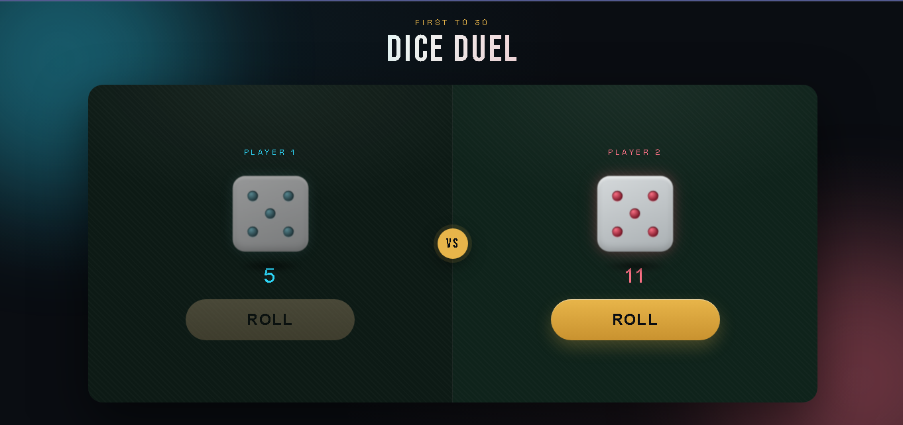

<div align="center">

# 🎲 Dice Duel

### A two-player dice game with real 3D dice and smooth animations


<br>

### 🎮 [View Live Demo](https://arshiya7-dev.github.io/Dice/)

<a href="https://arshiya7-dev.github.io/Dice/">
  
</a>

</div>

## ✦ Preview

<p align="center">
  
</p>

---


<br>

## 📖 About The Project

**Dice Duel** is a two-player dice game that runs entirely in the browser. Players take turns rolling the dice, watching it tumble through a real 3D animation before landing on a number. That number gets added to their score, and whoever reaches **30** points first wins the game. There's a small twist that keeps things exciting: rolling a **6** doesn't pass the turn — the same player gets to roll again! 🔥

## ✨ Features

- 🎲 **Real 3D dice** with six fully built faces and standard pip layouts, built using `transform-style: preserve-3d`
- 🌀 **Two-stage roll animation** — a fast random tumble followed by a smooth landing on the final number with natural easing
- 🥊 **Turn-based two-player mode** that automatically disables the button of whichever player isn't up
- 🍀 **Bonus turn rule** — rolling a 6 grants an extra turn
- 🏆 **Automatic game-over detection** that announces the winner once a player reaches 30 points
- 🎨 **Modern, colorful design** featuring animated background blobs, per-player glow effects (cyan/pink), and distinctive typography (Bebas Neue + Space Grotesk)
- 📱 **Fully responsive** for both mobile and desktop
- ♿ Respects `prefers-reduced-motion` for users who prefer less animation

## 🛠️ Built With

| Technology | Purpose |
|---|---|
| HTML5 | Page structure |
| Tailwind CSS v4 | Styling via `@apply` and arbitrary-value classes |
| CSS 3D Transforms | Building and rotating the 3D dice |
| Vanilla JavaScript | Game logic and animation control |
| Google Fonts | Bebas Neue and Space Grotesk typefaces |

## 🚀 Running Locally

```bash
# Clone the repository
git clone https://github.com/arshiya7-dev/Dice.git

# Move into the project folder
cd Dice

# Open index.html in your browser
```

If you want to rebuild the compiled CSS yourself (e.g. after editing `main.css`), run:

```bash
npx @tailwindcss/cli -i ./asset/stylesheet/main.css -o ./asset/stylesheet/output.css --watch
```

## 📁 Project Structure

```
Dice/
├── index.html
├── asset/
│   ├── stylesheet/
│   │   ├── main.css       # Main Tailwind source file
│   │   └── output.css     # Compiled CSS output
│   └── javascript/
│       └── script.js      # Game logic
└── README.md
```

## 🎯 How To Play

1. A player is randomly chosen to go first
2. Click the **Roll Dice** button for the active player
3. The dice tumbles and lands on a number, adding it to that player's score
4. If the roll isn't a 6, the turn passes to the other player
5. The first player to reach 30 points wins the game! 🏆

---

<div align="center">

Made with ❤️ by **[Arshiya](https://github.com/arshiya7-dev)**

⭐ Star this repo if you found it helpful!

</div>
